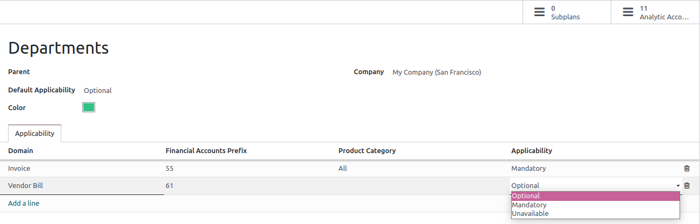
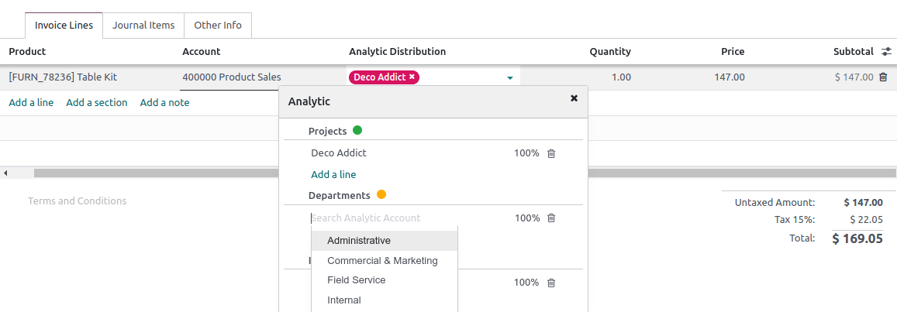

===================
Analytic accounting
===================

:guilabel:`Analytic accounting` helps you to track costs and revenues, by project or department.
When creating your journal entries, an analytic widget allows the distribution on one or more
analytic accounts.

Configuration
=============

You can enable the :guilabel:`Analytic Accounting` feature by going to :menuselection:`Accounting
--> Configuration --> Settings --> Analytics`.

Analytic accounts
=================

The :guilabel:`Analytic accounts` are used to track specific expenses.

Your existing :guilabel:`Analytic accounts` are available by going to :menuselection:`Accounting -->
Configuration --> Analytic Accounting: Analytic accounts`. Click :guilabel:`New` to create an
:guilabel:`Analytic account`, and fill in the required information:

- :guilabel:`Analytic Account`: add the name of your project.
- :guilabel:`Customer`: select the customer related to your project.
- :guilabel:`Reference`: add a reference to make it easier to find the account when you are on your bill.
- :guilabel:`Plan`: an :guilabel:`Analytic account` must be related to at least one :guilabel:`Analytic plan`.
- :guilabel:`Company`: select the company for which the analytic account will be used.
-  :guilabel:`Currency`: select the currency of the analytic account.

Then, fill in your budget information (ADD: Link to Manage a financial budget).

Analytic plans
==============

You can access the :guilabel:`Analytic Plans` by going to :menuselection:`Accounting -->
Configuration --> Analytic Accounting: Analytic Plans`. Click :guilabel:`New` to create a new one.

The following information must be completed:
- :guilabel:`Parent`: add another :guilabel:`Analytic Plan` to build a hierarchy between your plans;
- :guilabel:`Default Applicability`: :guilabel:`Optional`, :guilabel:`Mandatory`, or :guilabel:`Unavailable`;
- :guilabel:`Color`: select the color of the tag related to this specific plan;
- :guilabel:`Company`: add the company to which the plan applies;
- :guilabel:`Domain`: :guilabel:`Miscellaneous`, :guilabel:`Invoice`, :guilabel:`Vendor Bill`,
:guilabel:`Expense`, :guilabel:`Purchase Order`, or :guilabel:`Sale Order`;

- :guilabel:`Financial Accounts Prefix`: the prefix that defines which accounts this applicability
   should apply on;
- :guilabel:`Product Category`: decide to which product category the plan applies;
- :guilabel:`Applicability`:

   - :guilabel:`Optional`: if selected, it is not mandatory to add the analytic plan in the widget;
   - :guilabel:`Mandatory`: if selected, a green bullet appears in the widget next to the plan;
   - :guilabel:`Unavailable`: if selected, not available in the widget.

Two smart buttons are available in the right top corner:
   - :guilabel:`Subplans`: can be created to have a more complex analytic structure. Click the
      :guilabel:`Subplans` smart button, and then :guilabel:`New` to add a subplan.
   - :guilabel:`Analytic Accounts`: to reach the subplans related to the plan.

.. note::
   - The analytic widget is prefilled based on the :guilabel:`Applicability`, and the
     :guilabel:`Analytic Distribution Models`.
   - Each :guilabel:`Analytic plan` must have at least one :guilabel:`Analytic account`.

Analytic distribution
=====================

When creating an invoice or a bill it is mandatory to fill in the :guilabel:`Analytic Distribution`
column. A **widget** opens. You can add **tags** to reflect the related
:guilabel:`Analytic accounts`, and decide how to split the costs between the accounts.

Analytic distribution models
----------------------------

The :guilabel:`Analytic Distribution Models` are templates that can be created by going to
:menuselection:`Accounting --> Configuration --> Analytic Distribution Models`. To create a new one,
click :guilabel:`New`, and set the conditions to meet to apply a specific distribution.

- :guilabel:`Partner`: select a partner for which the analytic distribution will be used;
- :guilabel:`Partner Category`: select a partner category for which the analytic distribution is
   used;
- :guilabel:`Accounts Prefix`: this analytic distribution will apply to all financial accounts
   sharing the prefix specified;
- :guilabel:`Product`: select a product for which the analytic distribution will be used;
- :guilabel:`Product Category`: select a product category which will use analytic account specified
   in analytic default;
- :guilabel:`Company`: select a company for which the analytic distribution will be used.
- :guilabel:`Analytic Distribution`: select the distribution to apply.

.. tip::
   To **mass edit** several entries simultaneously, go to :menuselection:`Accounting --> Accounting
   --> Journal items`, and select the ones that need to be updated. Add the required distribution in
   the :guilabel:`Analytic Distribution` column, and click on the :guilabel:`floppy disk` icon to
   save. The :guilabel:`Analytic distribution template` pops up, and you can save it for later use.
