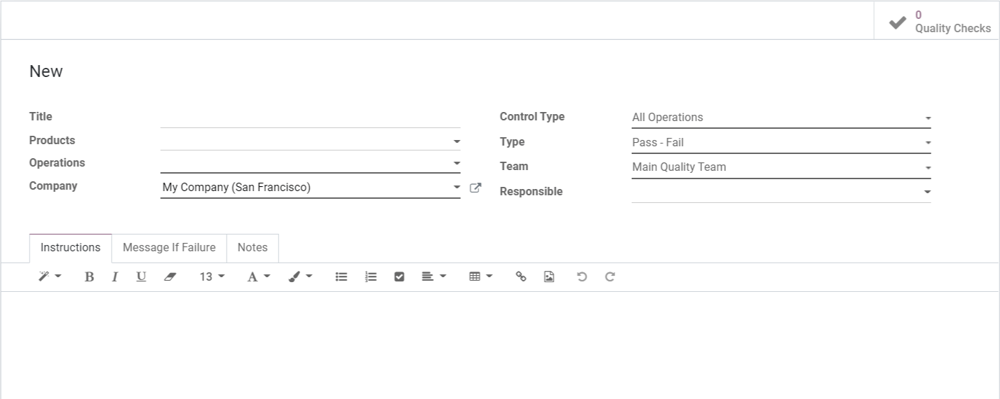

================================
Configure quality control checks
================================

Quality control is an essential part of the manufacturing process. Odoo's Quality module can be
used to control the quality of products before they are registered into stock, during picking
operations, and when leaving the warehouse in a delivery order. This is accomplished by creating
*Quality Control Points* that will automatically trigger quality checks at specific points during
production.

Create and configure quality control points
===========================================

To create a quality control point, go to :menuselection:`Quality Control --> Control Points -->
Create`. From here, configure the new control point based on the desired quality check workflow.

Products
--------

Select the specific product or products that the check is performed on.

Operations
----------

Choose the type of operation that should be performed during the quality check. Certain operations
also allow for the selection of a specific work order.

.. example::
   Specify that a quality check should be performed during the manual assembly work order of the
   manufacturing operation.

.. tip::
   To perform a quality check on products produced by subcontractors, select :guilabel:`Your
   Company: Receipts`. A quality check will be created each time delivery of a product is
   validated.

Control settings
----------------

:guilabel:`Control Type` specifies if the check should be performed randomly, at specified
intervals, or on all operations. :guilabel:`Type` determines the nature of the quality check to be
performed:

- :guilabel:`Instructions`: Perform a check based on the details in the instructions tab.
- :guilabel:`Take a Picture`: Upload a picture of the product being checked. The device that the
  picture was taken with should also be specified.
- :guilabel:`Pass - Fail`: A quality check with no tolerance should be performed. The product will
  either pass or fail the check.
- :guilabel:`Measure`: The product should be measured to ensure quality. The norm measurement and
  the tolerance can be specified, as well as the device that should be used to take the measurement.

Assignment settings
-------------------

The :guilabel:`Team` selection can be used to specify the quality team responsible for performing
the check. :guilabel:`Responsible` allows for a specific employee to be assigned to the check.

Details
-------

The tabs at the bottom of the form can be used to provide additional information to quality teams.
:guilabel:`Instructions` describes the quality check to be performed. :guilabel:`Message If
Failure` details what should be done if the check fails. Any additional information about the check
can be entered in the :guilabel:`Notes` tab.

Quality check automation
========================

Once a control point has been configured, a quality check will be automatically created and
assigned when the specified operation or work order has been reached. Quality checks can be managed
by selecting :menuselection:`Quality Control --> Quality Checks`.

.. tip::
   To see all of the quality checks created by a control point, go to :menuselection:`Quality
   Control --> Control Points`, select a control point, and click :guilabel:`Quality Checks` in the
   top right corner.
