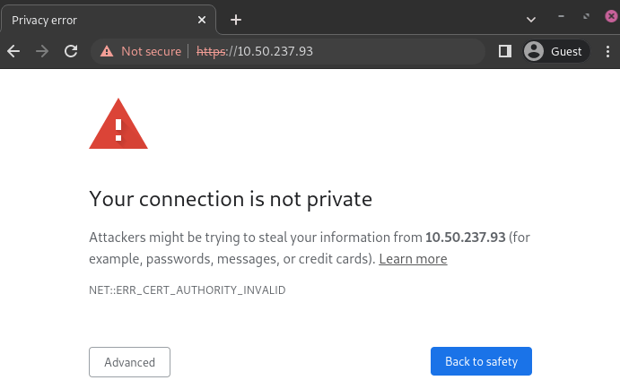

.. _epos_ssc/ePOS printers:

=============
ePOS printers
=============

ePos printers are explicitly designed to work with your Point of Sale system, which sends the
tickets directly to the printer.

.. note::
   These `Epson ePOS printers
   <https://c4b.epson-biz.com/modules/community/index.php?content_id=91>`_ are compatible with Odoo:

   - TM-H6000IV-DT (Receipt printer only)
   - TM-T70II-DT
   - TM-T88V-DT
   - TM-L90-i
   - TM-T20II-i
   - TM-T70-i
   - TM-T82II-i
   - TM-T83II-i
   - TM-T88V-i
   - TM-U220-i
   - TM-m10
   - TM-m30
   - TM-P20 (Wi-Fi® model)
   - TM-P60II (Receipt: Wi-Fi® model)
   - TM-P60II (Peeler: Wi-Fi® model)
   - TM-P80 (Wi-Fi® model)

To use the printer in Odoo, models that do not require an :doc:`IoT box
<../../../productivity/iot/config/connect>` may need to establish a secure connection between their
browser and the printer with :doc:`the HTTPS protocol <https>`. If so, trying to reach the printer
IP address in HTTPS induces a warning page.

   Warning page on Google Chrome, Windows 10

In that case, you can force the connection by clicking :guilabel:`Advanced` and :guilabel:`Proceed
to [IP address] (unsafe)`. Doing so allows you to reach the page in HTTPS and use the ePOS printer
in Odoo as long as the browser window stays open.

.. warning::
   The connection is lost after closing the browser window. Therefore, this method should only be
   used as a **workaround** or as a pre-requisite for the following instructions.

For a long-term solution, generating, exporting, and importing a **self-signed certificate** is
mandatory.

Generate, export and import self-signed certificates
====================================================

.. tabs::

   .. tab:: Windows 10 & Linux OS

      .. tabs::

         .. tab:: Generate a self-signed certificate

            After forcing the connection, sign in using your printer credentials to access the ePOS
            printer settings. To sign in, enter `epson` in the :guilabel:`ID` field and your printer
            serial number in the :guilabel:`Password` field.

            Click :guilabel:`Certificate List` in the :guilabel:`Authentication` section, and click
            :guilabel:`create` to generate a new **Self-Signed Certificate**. The :guilabel:`Common
            Name` should be automatically filled out. If not, fill it in with the printer IP address
            number. Select the number of years during which the certificate will be valid in the
            :guilabel:`Validity Period` field, click :guilabel:`Create`, and :guilabel:`Reset` or
            turn the printer off and back on.

            The self-signed certificate is generated. Reload the page and click :guilabel:`SSL/TLS`
            in the :guilabel:`Security` section to ensure **Selfsigned Certificate** is correctly
            selected in the :guilabel:`Server Certificate` section.

         .. tab:: Export a self-signed certificate

            The export process is heavily dependent on the :abbr:`OS (Operating System)` and the
            browser. Start by accessing your ePOS printer settings on your web browser by navigating
            to its IP address, for example, `https://192.168.1.25`. Then, force the connection as
            explained in the :ref:`introduction <epos_ssc/ePOS printers>`.

            - If you are using a **Google Chrome** browser,

              #. click :guilabel:`Not secure` next to the search bar, and :guilabel:`Certificate is
                 not valid`;

                 .. image:: epos_ssc/browser-warning.png
                    :align: center
                    :alt: Connection to the printer not secure button in Google Chrome browser.

              #. go to the :guilabel:`Details` tab and click :guilabel:`Export`;
              #. add `.crt` at the end of the file name to ensure it has the correct extension;
              #. select :guilabel:`Base64-encoded ASCII, single certificate`, at the bottom of the
                 pop-up window;
              #. save, and the certificate is exported.

            .. warning::
               Make sure that the certificate ends with the extension `.crt`. Otherwise, some
               browsers might not see the file during the import process.

            - If you are using a **Mozilla Firefox** browser,

              #. click the **lock** icon next to the search bar;
              #. go to :menuselection:`Connection not secure --> More information --> Security tab
                 --> View certificate`;

              .. image:: epos_ssc/mozilla-not-secure.png
                 :align: center
                 :alt: Connection is not secure button in Mozilla Firefox browser

              #. scroll down to the :guilabel:`Miscellaneous` section;
              #. click :guilabel:`PEM (cert)` in the :guilabel:`Download` section;
              #. save, and the certificate is exported.

         .. tab:: Import a self-signed certificate

            The import process is heavily dependent on the :abbr:`OS (Operating System)` and the
            browser.

            .. tabs::

               .. tab:: Windows 10

                  On Windows 10, the :abbr:`OS (Operating System)` handles the certificates.
                  Therefore, importing self-signed certificates originates from the certification
                  file itself, and not the browser. To do so,

                  #. open the Windows File explorer and locate the downloaded certification file;
                  #. click right on the certification file and click :guilabel:`Install
                     Certificate`;
                  #. select where to install the certificate; you can install it just for the
                     current logged-in user (:guilabel:`Current User`) or all users
                     (:guilabel:`Local Machine`). Then, click :guilabel:`Next`;
                  #. on the `Certificate Store` screen, tick :guilabel:`Place all certificates in
                     the following store`, click :guilabel:`Browse...`, and select
                     :guilabel:`Trusted Root Certification Authorities`;

                     .. image:: epos_ssc/win-cert-wizard-store.png
                        :align: center

                  #. click :guilabel:`Finish` and accept the pop-up security window;
                  #. restart the computer to make sure that the changes are applied.

               .. tab:: Linux

                  - If you are using a **Google Chrome** browser,

                    #. open your Chrome browser;
                    #. go to :menuselection:`Settings --> Privacy and security --> Security -->
                       Manage certificates`;
                    #. go to the :guilabel:`Authorities` tab, click :guilabel:`Import` and select
                       the exported certification file;
                       accept all warnings, click :guilabel:`ok`;
                    #. restart your browser.

                  - If you are using a **Mozilla Firefox** browser,

                    #. open your Firefox browser;
                    #. go to :menuselection:`Settings --> Privacy & Security --> Security --> View
                       Certificates... --> Import`;
                    #. select the exported certification file;
                    #. tick the checkboxes and validate;
                    #. restart your browser.

   .. tab:: Mac OS

      On Mac OS, open a Safari webpage to secure the connection. Then, navigate to your printer IP
      address. Doing so induces a warning page. From there, go to :menuselection:`Show Details -->
      visit this website --> Visit Website` and validate.

      Reboot the printer to use it from any other browser.

   .. tab:: Android OS

      On your Android device, open the settings and search for `certificate` Then, click
      :guilabel:`Certificate AC` (Install from device storage), and select the certificate.

.. important::
   - If you want to export certificates from an OS or a browser that is not mentioned, search for
     `export SSL certificate + [your browser/your OS]` in your preferred search engine.
   - If you want to import certificates from an OS or a browser that is not mentioned, search for
     `import SSL certificate root authority + [your browser/your OS]` in your preferred search
     engine.

Check if the certificate was imported correctly
===============================================

To check that your connection is secured, connect back to the IP of your printer in https, for
example, `https://192.168.1.25`. If the certificate is applied, you should no longer have the
browser warning page and the address bar should indicate that the connection is in HTTPS (generally
symbolised by a padlock).
