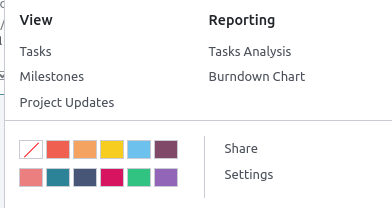
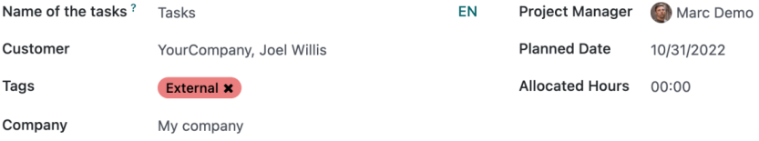

==================
Project management
==================

Odoo Project uses the **Kanban** project management system. This means all projects are broken down
into tasks, which are categorized on a whiteboard according to what production phase they are in.

.. admonition:: Did you know?

   The word **Kanban** comes from Japanese and refers to the "visual board" management method.

.. seealso::
   `Odoo Tutorials: Kanban Project Management
   <https://www.odoo.com/slides/slide/kanban-project-management-1664>`_

Configuration
=============

Open the **Project** app and click :guilabel:`Create` to start a new project. Enter a
:guilabel:`Name` for your project and click :guilabel:`Create Project`.

You can customize your existing **projects** from the dashboard by clicking the drop-down toggle
button (:guilabel:`⋮`) on your project's **card**.

This enables a new menu divided into four parts:

- **View**: see an overview of your project's components, such as its tasks, milestones and project
  updates. Depending on which apps you have activated, more options may be available, such as
  **Documents**: all uploaded files can be found under this menu, as well as in the **Documents**
  app, under :guilabel:`Projects`;

- **Reporting**: analyze your project's progress and profitability through graphics and statistics;

- **Color**: make a line of color appear on the left side of the card so that your project is more
  recognizable;

- **Settings**: you can change the following:

  - the :guilabel:`Name` of the project;
  - the :guilabel:`Name of the tasks` found under that project.
  - the :guilabel:`Customer` for whom the project is intended;
  - the :guilabel:`Tags` used for filtering;
  - the :guilabel:`Company` responsible for the project;
  - the employee designated as :guilabel:`Project Manager`;
  - the :guilabel:`Planned Date` of the project;
  - the total :guilabel:`Allocated Hours` for that project.

Additionally, you can mark the project as a :guilabel:`Favorite`, allowing you to find it using the
:guilabel:`My Favorites` filter on the Kanban view;

.. seealso::
   `Odoo Tutorials: Customize your project
   <https://www.odoo.com/slides/slide/customize-your-project-1662?fullscreen=1>`_

Depending on the apps you have activated, other options are available:

- **Sales orders**: you can view related :abbr:`SO (Sales Order)` for that project under the
  :guilabel:`Invoicing` tab by activating the **Invoicing** app;

- **Billable**: you can set the project as :guilabel:`Billable` by activating the **Invoicing** or
  **Accounting** apps;

- **Log time**: you can log time on tasks by activating the **Timesheet** app;

- **Plan resources**: you can plan resources on tasks by activating the **Planning** app;

- **Analytic account**: you can set an :guilabel:`Analytic Account` for that project if you have
  the **Accounting** app activated as well as the *Analytic Accounting* option in the
  configurations.

.. seealso::
   `Analytic account use cases
   <https://www.odoo.com/documentation/16.0/applications/finance/accounting/others/analytic/usage.html>`_

Scheduling activities
=====================

You can schedule **activities** (ex. :guilabel:`Call`, :guilabel:`Meeting`, etc.) per project by
clicking on the **clock** icon on a project. doing so opens a list with already scheduled activities
and allows planning **new** activities by clicking :guilabel:`+ Schedule an activity`. On the pop-up
window, select the :guilabel:`Activity Type`, enter a :guilabel:`Summary` for that activity, a
:guilabel:`Due Date`, and assign the project to an employee. According to the :guilabel:`Activity
Type`, you may have **additional options** available.

.. note::
   If an activity is **already** scheduled, the icon may change to a **phone**, **group of
   people**, or other.
